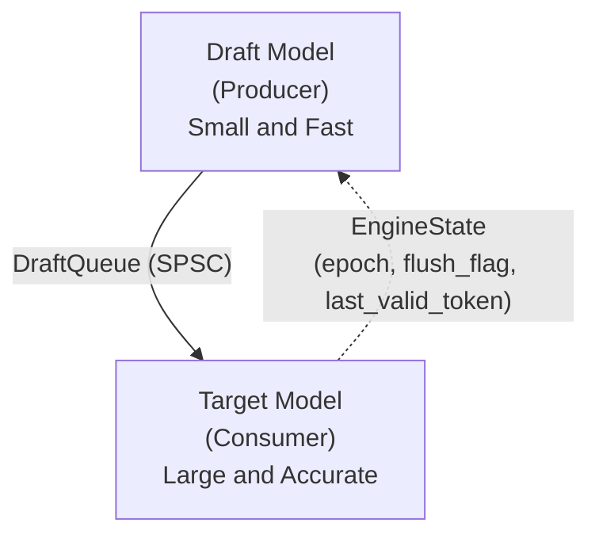

# SPEC - Speculative Pipeline for Efficient Continuous Decoding

A **lock-free**, **asynchronous speculative decoding engine** built in Rust, exposed to Python. _SPEC_ runs a draft model and a target model on **separate threads**, coordinating them through a custom lock-free SPSC ring buffer and epoch-based rollback state machine for maximum throughput.

## Architecture



**How it works:**

1. **Prefill** — Both models process the prompt to populate their KV caches.
2. **Draft (Producer Thread)** — The small model continuously generates speculative tokens and pushes them to a lock-free SPSC ring buffer.
3. **Verify (Consumer Thread)** — The large model pulls batches from the queue and verifies each token using rejection sampling against its own probability distribution.
4. **Accept/Reject** — Accepted tokens are appended to the output. On rejection, the consumer triggers an epoch-based rollback that flushes the queue and signals the producer to reset its KV cache.

## Quick Start

### Prerequisites

- **Rust** (stable, 2021 edition)
- **Python** ≥ 3.9
- **[uv](https://github.com/astral-sh/uv)** (Python package manager)
- **[maturin](https://www.maturin.rs/)** (Rust-Python build tool)

### Build & Install

```bash
# Clone the repo
git clone https://github.com/sethigeet/SPEC.git
cd SPEC

# Create virtualenv and install build deps
uv sync

# Build the Python extension module
uv run maturin develop
```

### Usage

#### Async Pipeline (Multi-Threaded)

```python
from spec_engine import AsyncSpecDecodingEngine

engine = AsyncSpecDecodingEngine(
    draft_model_id="HuggingFaceTB/SmolLM2-135M",
    target_model_id="HuggingFaceTB/SmolLM2-360M",
    gamma=5,           # draft tokens per verification batch
    seed=42,
)

output = engine.generate("The meaning of life is", max_tokens=100)
print(output)
```

#### Synchronous Pipeline

```python
from spec_engine import SpecDecodingEngine

engine = SpecDecodingEngine(
    draft_model_id="HuggingFaceTB/SmolLM2-135M",
    target_model_id="HuggingFaceTB/SmolLM2-360M",
    gamma=5,
    temperature=0.0,    # greedy decoding
    seed=42,
)

output = engine.generate("The meaning of life is", max_tokens=100)
print(output)
```

## Concurrency Design

### Lock-Free SPSC Queue (`DraftQueue`)

Fixed-capacity ring buffer using atomic operations. No mutexes, no `std::sync::mpsc`.

- **Capacity** must be a power of 2 (bitwise modulo `& (capacity - 1)`).
- **Producer** writes to `head` (`Ordering::Release`) after storing the token.
- **Consumer** reads `head` (`Ordering::Acquire`) before reading tokens, writes `tail` (`Ordering::Release`).
- **Cache-line padding** via `crossbeam_utils::CachePadded` prevents false sharing.

### Epoch-Based Rollback (`EngineState`)

When the target model rejects a drafted token:

1. Consumer stores the corrected token in `last_valid_token`.
2. Sets `flush_flag = true` (Release).
3. Increments `epoch` (Release).
4. Flushes the SPSC queue.

The producer checks `flush_flag` before every push. On flush, it truncates its KV cache, syncs to the corrected token, and calls `acknowledge_flush()`.

### Paged KV Cache

Block-based KV cache with epoch tagging. On rollback, all blocks from the dead epoch are bulk-freed in O(n) where n is the number of speculative blocks.

## Features

| Feature      | Description                  |
| ------------ | ---------------------------- |
| `cuda`       | Enable CUDA GPU acceleration |
| `flash-attn` | Use Flash Attention v3       |
